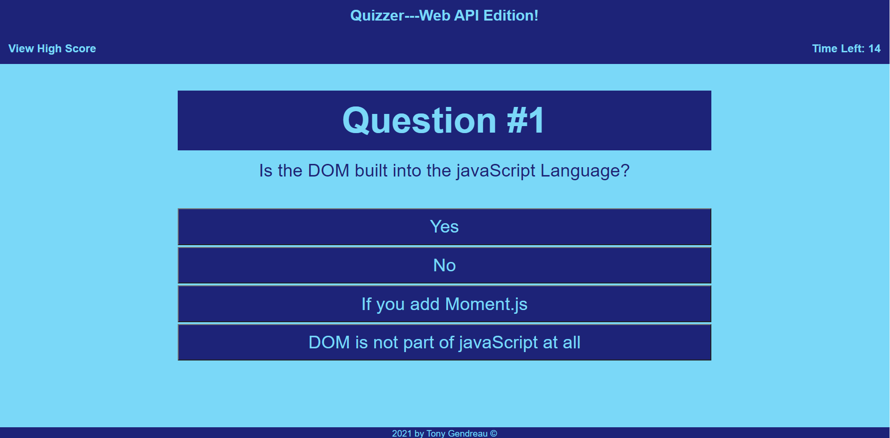

# Web-APIs-Challenge-Code-Quiz

## Purpose
A website that quizzes the user over Web API information.  Could be used to prepairing for a technical interview.  

## Built with
* HTML
* CSS
* Javascript

## Demonstrates the following skills:

## 
    * Working with an array of Objects.
    * Working with arrays.
    * Working with strings.
    * Working with complicated logic
    * Dynamically creating web elements.
    * Using localStorage to save a high scores list.
    * Using states in the program to track the current screen
      so the user can check the High Scores at anytime and return
      to the exact screen they were at.  
    * Use of a timer to track a countdown.  Timer is paused when the
      the user checks high score and starts working again when they
      return to the quiz.

## Website
https://tgtiburon.github.io/Web-APIs-Challenge-Code-Quiz/

##

Made by Tony Gendreau

