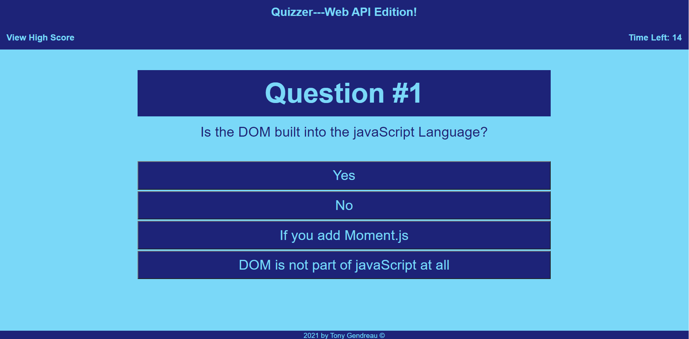

# Web-APIs-Challenge-Code-Quiz
---

  
  
   
   
   
## Description

A website that quizzes the user over Web API information. Could be used to prepare for a technical interview.

---
  ## Table of Contents

  [Features](#features)

  [Screenshot](#screenshot)
    
  [Usage](#usage)
    
  [License](#license)

  [Questions](#questions)
  
  

---

## Features

      1. Working with an array of objects. 

      2. Working with arrays. 

      3. Working with complicated logic. 

      4. Using localstorage to save a high scores list. 

      5. Using stats to track the current screen so the user can check high scores and return to the proper screen at anytime. 

      6. Use of a timer to trac time for a high score feature. 

      7. Timer pauses when on the high score screen. 

      8. Responsive design. 
---

## Screenshot 
  
  
  

---
  ## Usage

      1. Go to https://tgtiburon.github.io/Web-APIs-Challenge-Code-Quiz/ 

  ---
  ## License 

  &emsp; 

      To read about the license of this project click the link below.

  &emsp;[License](https://github.com/tgtiburon/Web-APIs-Challenge-Code-Quiz/blob/main/LICENSE) 

---
## Questions

If you have any questions about this project feel free to email me at <tg.tiburon@gmail.com>.  

To see the rest of my portfolio, visit [Github](https://github.com/tgtiburon).

Below is a graphic displaying my most used languages on github.

This Readme file was created with Readme Architect by Tony Gendreau &copy;
